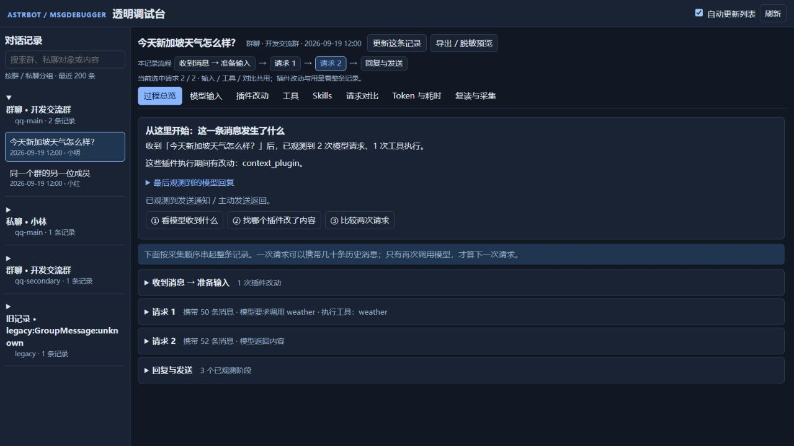
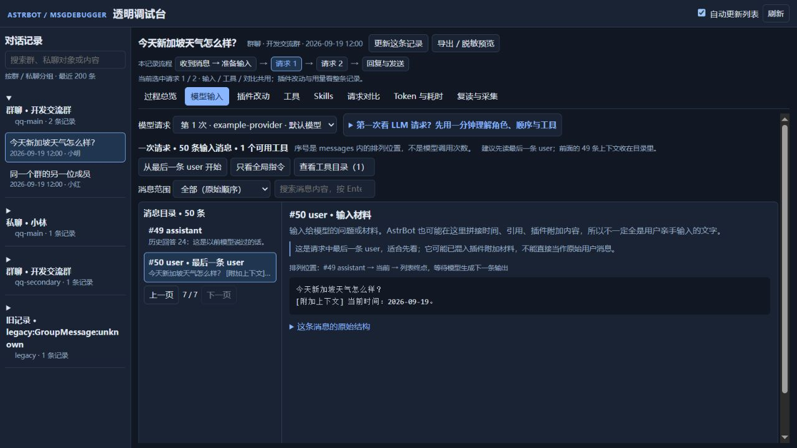

# 从一条消息开始排查

入口不变：AstrBot WebUI → 插件 → MsgDebugger → Pages → **logs**。

## 推荐阅读顺序

1. 在左侧展开一个**群聊或私聊对象**，选中一次消息记录。平台实例不同的同号群不会混在一起。每组列表分页；没有归属信息的旧记录按原会话单独显示。
2. 先看**过程总览**。这里概括原始输入、模型请求次数、工具执行和有改动的插件，再按时间顺序分开显示“准备、模型请求、工具执行、Agent 输出、发送前处理、发送完成”。子代理运行期间也可能出现发送前处理钩子，它不代表整条对话已经结束。展开其中一段才会出现详细日志。
3. 点**① 看模型收到什么**。输入默认定位请求中最后一条 `user`，其余上下文放在左侧消息目录，每页最多 8 条；右侧只阅读一条消息。可按角色筛选、搜索内容或切换目录页。
4. 如果模型调用了多次，点顶部流程里的**请求 2**等按钮。输入页会说明和前次请求有多少条相同的前缀；“定位本次新增 / 变化处”会跳到第一个不同位置。该位置可能是修改或新增，不代表之前所有内容都没变。
5. 看见可疑内容后，去**插件改动**找修改来源，或用**请求对比**查看完整差异。顶部流程在所有标签中保留，选中的模型请求由模型输入、工具、对比共用；插件改动和用量仍展示整条记录。

## 第一次接触 LLM API

输入页提供可展开的一分钟教程，介绍 `model`、`messages`、`tools`、返回消息和 `usage`，并解释各个角色、工具执行循环，以及额外内容分块。

**50 条输入消息不等于调用模型 50 次。** 一次请求会携带一个有顺序的 `messages` 列表，历史问题与历史回复也可能在里面。请求中的 `assistant` 是带入的上下文；本次生成的输出在输入列表之外单独查看。`user` 可能混有 AstrBot 或插件附加的材料，不一定等于用户原话。

每条消息都有角色解释、在列表中的前后位置和原始内容。`#50` 只表示它是列表的第 50 项。可以从最后一条 `user` 开始读，再按需看全局指令、先前上下文、工具调用和结果。

截图使用合成示例数据，包含 50 条消息、两次模型请求和一次工具执行，不含真实聊天内容。

## 导航变化与布局

- 原模型输入的长卡片列表 → 分页消息目录 + 单条内容阅读器。
- 原总览的逐阶段长日志 → 流程分段，详细日志默认折叠。
- 原左侧平铺记录 → 按平台实例、群聊 / 私聊对象分组。
- 八个标签和 `logs` 入口保留；新增贯穿标签的执行流程导航。
- 缩小标题区、卡片间距和工具栏；宽屏的会话列表与内容区分别滚动，窄屏自动上下排列。

自动刷新只更新左侧列表；详情使用“更新这条记录”，避免正在阅读的内容跳动。新增归属字段需要重载插件后采集新消息；缺少信息的旧记录不会被猜测性归类。

采集能力、存储限制、可选插件接入见 [项目说明](../../README.md)。

## 采集状态与变化内容

工具记录同时覆盖主代理的 AstrBot 工具事件和使用默认 Agent 钩子的嵌套 `tool_loop_agent`。嵌套工具会标记 `agent_scope: nested`。AstrBot 的工具异常路径不会调用结束钩子，调试器会从实际写回模型的 `error:` 工具结果补记“子代理工具失败”。使用自定义 Agent 钩子或第三方 Runner 的工具仍可能只能从模型请求中看到，页面不会据此假定工具已执行。

技能开关与所属插件状态分开显示。插件停用或未注册时，即使技能开关仍开启，该插件技能也会被 AstrBot 请求筛选器排除；最终以选中请求携带的目录为准。

插件改动现在默认展开红色删除 / 绿色新增的差异，仅保留少量上下文；原始修改前后快照仍可展开。差异太长会标注截断，旧记录重新打开后也可查看。

Skills 上半部展示选中请求的标准技能目录，下半部展示当前本地文件及全局开关。人格或配置可能进一步筛选技能；目录进入请求不代表模型读取或执行了技能。全局目录可手动刷新。自定义提示词格式和截断快照无法保证识别。

新记录支持 AstrBot Pydantic v1 消息组件。旧记录中的 unavailable 表示当时采集器未能记录组件，无法恢复已缺失字段。响应返回后的 GeneratorExit 不再当成调用失败；完整响应前关闭或取消记为请求中断。旧版响应后的同类误报保留原文并作说明。
